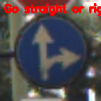
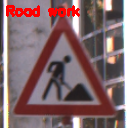
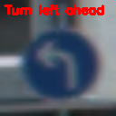
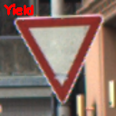

# Traffic Sign classification using CNN 

This repository contains a CNN model for classification of traffic signs on the [GTSRB](https://www.kaggle.com/datasets/meowmeowmeowmeowmeow/gtsrb-german-traffic-sign) dataset.

## Contents
- [Requirements](#requirements)
- [Implementation](#implementation)
- [Results](#results)
- [Dataset](#dataset)

## Results

## Dataset

The dataset used in this project is the [German Traffic Sign Recognition Benchmark](https://www.kaggle.com/datasets/meowmeowmeowmeowmeow/gtsrb-german-traffic-sign) dataset. It contains 43 classes and almost 52k images.